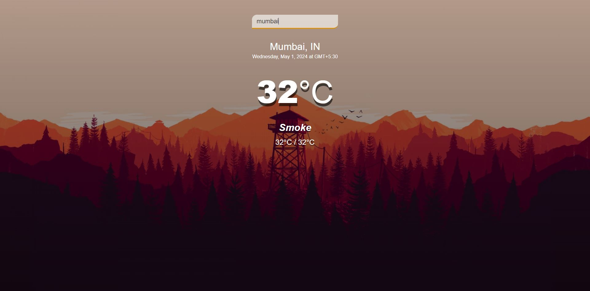

# Weather App

A simple weather app that allows users to check the current weather conditions of any city around the world.



## Features

- **Real-time Weather Data**: Get up-to-date weather information including temperature, weather condition, and more.
- **Search Functionality**: Enter the name of any city to check its weather instantly.
- **Responsive Design**: Works seamlessly on desktop, tablet, and mobile devices.

## Technologies Used

- **HTML**: Structure of the web page.
- **CSS**: Styling and layout of the app.
- **JavaScript**: Handling user interactions and fetching weather data from the OpenWeatherMap API.
- **OpenWeatherMap API**: Used to retrieve real-time weather information.

## How to Use

1. Clone the repository:

    ```bash
    git clone https://github.com/anmoljamespilley/Anmol_JS3_Lab.git
    ```

2. Open `index.html` in your web browser.

3. Enter the name of a city in the search box and press Enter.

4. View the current weather information for the entered city.

## Usage Example

Here's a quick example of how to use the weather app:

1. Open the app in your web browser.
2. Type "Chennai" in the search box.
3. Press Enter.
4. You'll see the current weather conditions for Chennai displayed on the screen.

## Credits

- **OpenWeatherMap**: For providing the weather data API.
- **Icons8**: For providing weather icons used in the app.

## Contributors
- [Anmol James Pilley](https://github.com/anmoljamespilley)

## Thank you
for checking out the Weather App! I hope you find it both professional and user-friendly.
